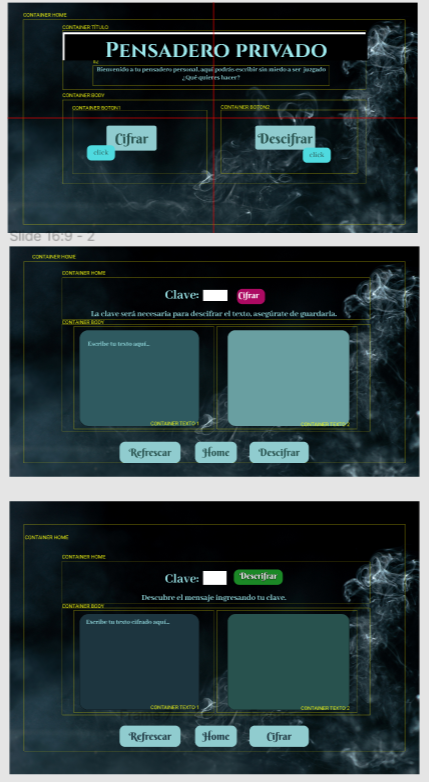

<h1 align="center"><strong>Pensadero Privado 🧙</strong><project-name></h1> 

Hi!👋 this is my first project as a Front-end student in Laboratoria, I hope u like it!<project-description>

***
*scroll down for spanish version*
***

## Description
Private pensieve is a page created for people who are afraid to write their ideas or thoughts because someone could read them without their consent.

The page is designed as a cloud where you can have your account and keep your thoughts encrypted thanks to an encryption page (whose method is based on Ceasar's cipher method) and recover them with a key through a decryption page (key must be the same to cipher and decipher text). However, this is an MVP (minimum viable project), so the functions to log in and the cloud to store thoughts are not yet developed. So far the main page and the encryption and decryption sections are working.

## The look 

The aesthetic was based on Harry Potter's movies saga, director Dumbledore possesses a magical artifact called the Pensieve that allows him to retrieve past memories.

This is the **Figma** prototype:

## How it works ⚙️

The encryption corresponds to the Ceasar's cipher method, so the text to be encrypted is moved according to the following formula, where offset can be any number greater than 0:

>(asciiNum - 65 + offset)%26 + 65)  
(asciiNum - 97 + offset)%26 + 97)

Decryption is done through 2 formulas that are executed under different conditions:

> asciiNum - (offset % 26)  
asciiNum + Math.abs((n*26 - offset))%26

## Github pages link

- [Pensadero privado en github pages](https://paulamanosalva.github.io/SCL018-cipher/ "proyecto desplegado")

## Availible commands

En el proyecto puedes correr:

### `npm start : npm test`,

Use npm start to display the page on a local server and npm test to test the encryption and decryption tests included in the project (these came by default and it was a requirement to pass them to progress to my next project in the bootcamp) 

## Built with

- Vainilla JavaScript
- HTML
- CSS

## Future updates

- I hope to complete the cloud and log in features when I'm a more advanced developer.

**Paula Manosalva**

- [Perfil](https://github.com/paulamanosalva "Paula Manosalva")
- [Email](mailto:pau.emd@gmail.com?subject=Hi "Hi!")
- [Website (en construcción)](https://paulamanosalva.github.io "Website en construcción")

## 🤝 Support

Comments, issues and suggestions are welcome!

leave a ⭐️ if u liked it!

***
***

## Descripción del proyecto
Pensadero privado (private pensieve) es una página creada para personas que temen escribir sus ideas o pensamientos debido a que alguien podría leerlos sin su consentimiento. 

La página está pensada como una nube donde puedes tener tu cuenta y guardar tus pensamientos encriptados gracias a una página de cifrado (cuyo método se basa en el cifrado César) y recuperarlos con una clave mediante una página de descifrado. Sin embargo, esto es un MVP (proyecto mínimo viable), por lo que aún no están desarrolladas las funciones para iniciar sesión ni tampoco la nube para almacenar los pensamientos 🛠️. Hasta ahora están funcionando la página principal y las secciones de cifrado y descrifrado.

## El look 

La estética se basó en la saga de películas de Harry Potter, donde el director Dumbledore posee un artefacto mágico llamado Pensadero que le permite recuperar memorias pasadas. 

Esta es una foto del prototipo realizado en **Figma**:

## ¿Cómo funciona? ⚙️

El funcionamiento de la encriptación corresponde al cifrado César, donde se desplaza el texto a cifrar de acuerdo a las siguientes fórmulas donde el offset o desplazamiento puede ser cualquier número mayor a 0:

>(asciiNum - 65 + offset)%26 + 65)  
(asciiNum - 97 + offset)%26 + 97)

El descifrado debe hacerse con el mismo offset del cifrado y se ejecuta mediante 2 fórmulas que se ejecutan bajo condiciones distintas:

> asciiNum - (offset % 26)  
asciiNum + Math.abs((n*26 - offset))%26

## Link a página desplegada

- [Pensadero privado en github pages](https://paulamanosalva.github.io/SCL018-cipher/ "proyecto desplegado")

## Comandos disponibles

En el proyecto puedes correr:

### `npm start : npm test`,

Usa npm start para visualizar la página en un servidor local y npm test para probar las pruebas de cifrado y descrifrado incluidas en el proyecto (estas venían por default y era un requisito pasarlas para progresar a mi siguiente proyecto en el bootcamp)

## Construído con

- Vainilla JavaScript
- HTML
- CSS

## Futuras actualizaciones

- Me gustaría completar las funciones de nube e inicio de sesión que hasta ahora solo son conceptuales.

**Paula Manosalva**

- [Perfil](https://github.com/paulamanosalva "Paula Manosalva")
- [Email](mailto:pau.emd@gmail.com?subject=Hi "Hi!")
- [Website (en construcción)](https://paulamanosalva.github.io "Website en construcción")

## 🤝 Support

Bienvenidas sean las contribuciones, sugerencias y comentarios que tengas para este proyecto.

Deja una ⭐️si te gustó 💜

